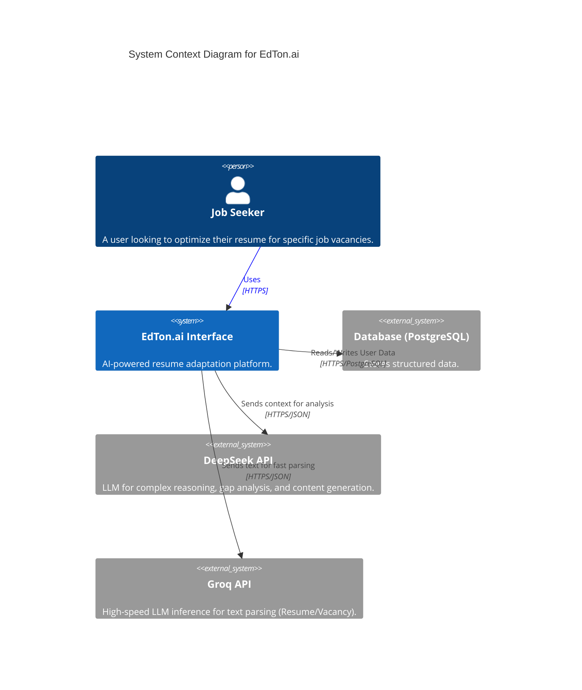
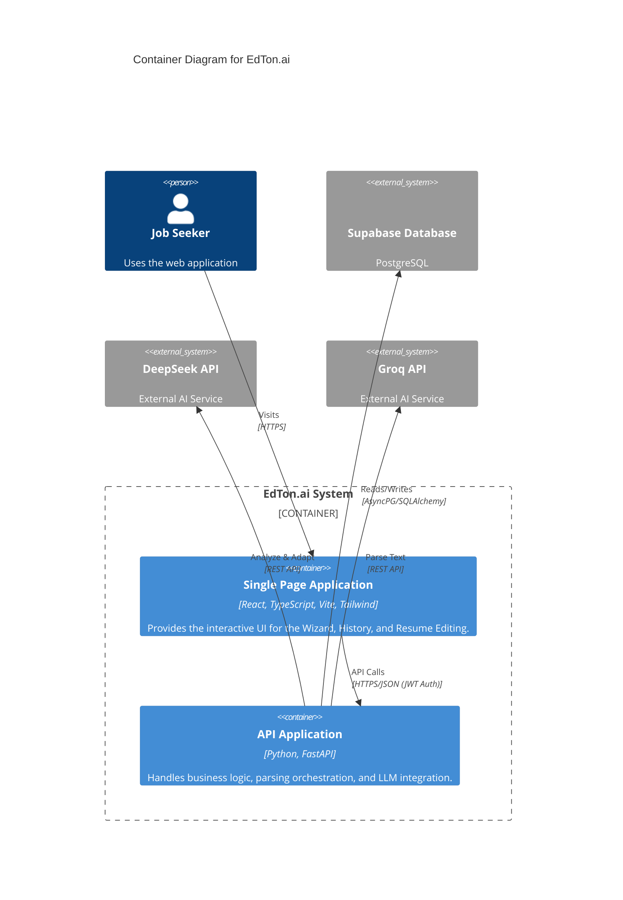
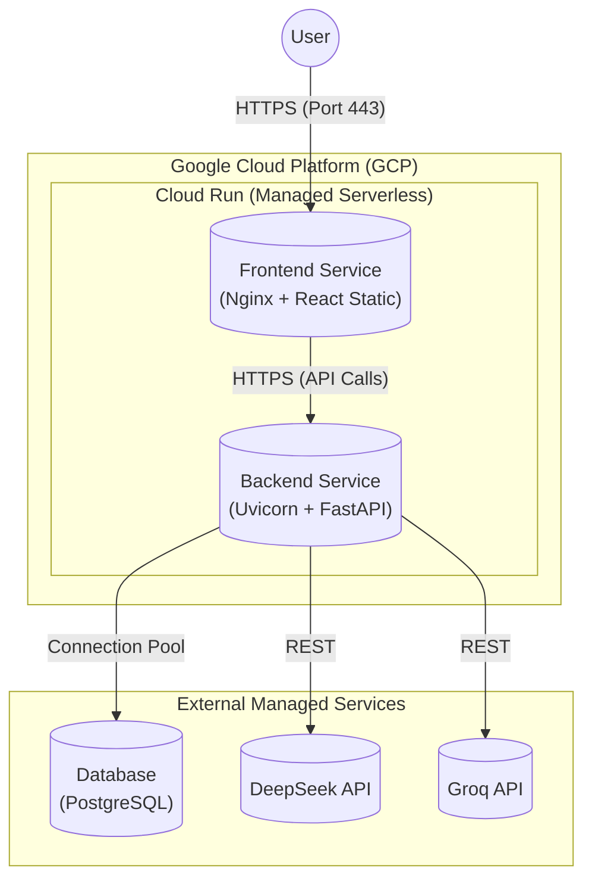

# Architecture Documentation

This document describes the architecture of **EdTon.ai** using the **C4 Model** (Context, Containers, Components, Code) and a Deployment diagram.

## 1. C4 Level 1: System Context Diagram

The System Context diagram shows the software system in the context of its users and external systems.

---

## 2. C4 Level 2: Container Diagram

The Container diagram shows the high-level shape of the software architecture and how responsibilities are distributed.

---

## 3. Deployment Diagram

The Deployment diagram illustrates how the system is hosted and the infrastructure used.

## 4. Key Decisions & Technology Stack

### Backend
- **FastAPI**: Chosen for high performance (async), automatic OpenAPI documentation, and easy integration with Pydantic for strict data validation (crucial for LLM structured outputs).
- **SQLAlchemy (Async) + Pydantic**: Ensures rigorous type safety from the database layer up to the API response.
- **dependency-injector**: `DeclarativeContainer` in `backend/containers.py` wires all services, repositories, AI providers and the DB session. Endpoints receive fully-assembled services via `Depends(get_xxx_service)`.
- **Protocol interfaces**: `repositories/interfaces.py` (8 protocols) and `services/interfaces.py` (7 protocols) decouple layers and enable unit testing with mocks.
- **CachedAIService**: Base class (`backend/services/base.py`) encapsulates the cache-check → AI-call → cache-save pattern shared by all AI services.
- **Typed error hierarchy**: `AppError` → `NotFoundError`, `ValidationError`, `ScraperError`, etc. Global handlers in `backend/errors/handlers.py` map them to proper HTTP codes.
- **Hybrid AI Approach**: 
    - **Groq (Llama 3)** is used for *parsing* tasks where speed is critical and complexity is moderate.
    - **DeepSeek V3** is used for *reasoning* tasks (gap analysis, content adaptation) where model intelligence is paramount.
- **Domain mappers**: Standalone functions in `backend/domain/mappers.py` keep ORM models free of business logic.

### Frontend
- **React + Vite**: Industrial standard for fast SPA development.
- **Tailwind CSS**: Utility-first styling for rapid UI iteration and consistent design system.
- **TanStack Query (React Query)**: Manages server state, caching, and background updates, significantly simplifying exact data fetching logic required for a wizard-like step interface.

---

## 5. Архитектурное обоснование для High-Load (Enterprise & MUP)

Для обеспечения надежности, производительности и успешного выдерживания нагрузок (Production-ready) были приняты следующие архитектурные решения.

### 5.1 Стратегия масштабирования (Scalability)
- **Горизонтальное масштабирование (Scale-Out):** API-слой приложения (FastAPI) изначально спроектирован как "stateless" (без сохранения состояния на диске контейнера). За счет этого балансировщик нагрузки (Google Cloud Run / Nginx) может автоматически увеличивать количество экземпляров (реплик) контейнеров `backend` в зависимости от входящего графика RPS или загрузки CPU. 
- **Вертикальное масштабирование (Scale-Up):** Используется для базы данных (Supabase/PostgreSQL), когда лимиты пула соединений (Connection Pool) исчерпаны. В GCP Cloud Run ресурсоемкие операции (вроде парсинга PDF-файлов) могут быть обеспечены выделением большего объема vCPU/RAM на контейнер.
- **Асинхронность:** FastAPI + Uvicorn + AsyncPG (драйвер БД) решают проблему "бутылочного горлышка" ввода-вывода (I/O) при вызовах к внешним провайдерам ИИ. Не блокируются воркеры в момент ожидания ответа от LLM. 

### 5.2 Обоснование базы данных по CAP-теореме
Проект использует реляционную базу данных **PostgreSQL** (через платформу Supabase).
Согласно CAP-теореме (Consistency, Availability, Partition Tolerance), в условиях изоляции сети (P) мы вынуждены выбирать между консистентностью (C) и доступностью (A).
- PostgreSQL традиционно строится как **CA** система, но в распределенной облачной архитектуре с репликацией он выступает как **CP-система**.
- **Бизнес-ценность:** Для EdtonAI критически важна **Консистентность (Consistency)** профиля пользователя, версионности (History) и биллинга (лимитов). Мы не можем позволить, чтобы пользователь видел устаревшие версии своего адаптированного резюме (что могло бы случиться при выборе AP-систем вроде Cassandra). В случае разрыва соединения (Partition) мы жертвуем доступностью узла записи, возвращая ошибку `503 Service Unavailable`, сохраняя абсолютную целостность ранее сгенерированных AI-документов.

### 5.3 Применение паттернов проектирования (GRASP и SOLID)

В основе модульного монолита Backend-части лежат принципы Clean Architecture и паттерны GRASP:
1. **Controller (Контроллер):** Все модули `routers` (например, `backend/api/v1/adapt.py`) выполняют исключительно роль точек входа и валидации (Pydantic). Они не содержат бизнес-логики, передавая задачу специализированным сервисам.
2. **Information Expert (Информационный эксперт):** Бизнес-логика, определяющая, к какому провайдеру ИИ обратиться (Groq или DeepSeek), инкапсулирована в фабрике моделей и базовом сервисе `CachedAIService` (`backend/services/base.py`). 
3. **Creator и Dependency Injection:** Инстанцирование сервисов вынесено в `backend/containers.py`. FastAPI использует `Depends` (DI), благодаря чему любой сервис получает уже готовый пул интерфейсов репозитория без жесткой связи между модулями.
4. **Polymorphism (Полиморфизм):** Интеграция с ИИ построена на интерфейсах (Factory Pattern). Если завтра потребуется перевести проект с DeepSeek на OpenAI, достаточно будет написать новый класс-адаптер без изменения бизнес-модулей `adapt.py` или `match.py`.
