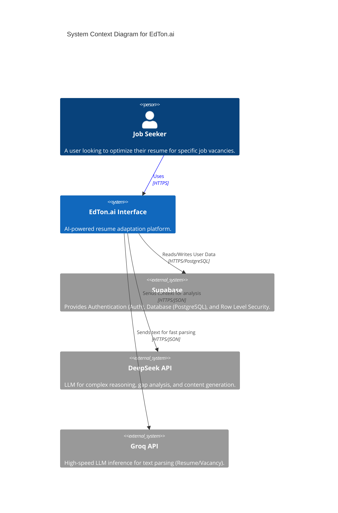
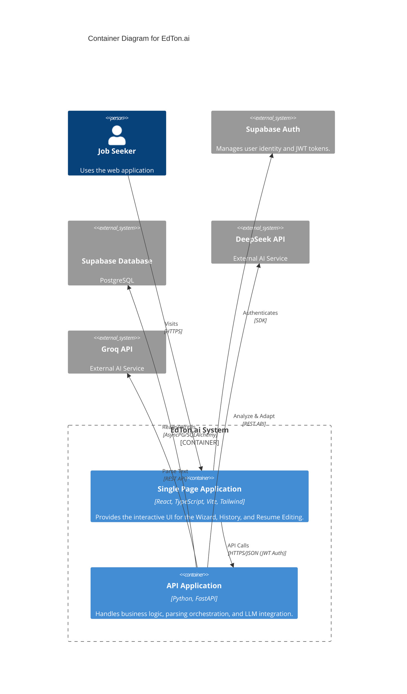
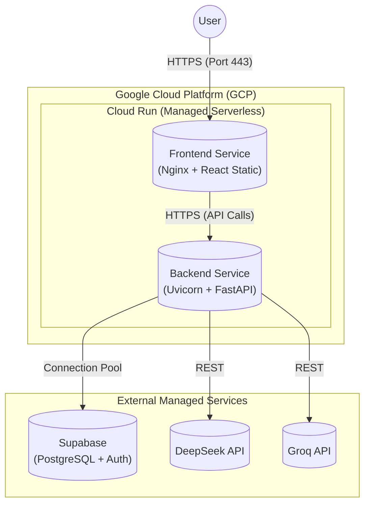

# Architecture Documentation

This document describes the architecture of **EdTon.ai** using the **C4 Model** (Context, Containers, Components, Code) and a Deployment diagram.

## 1. C4 Level 1: System Context Diagram

The System Context diagram shows the software system in the context of its users and external systems.

---

## 2. C4 Level 2: Container Diagram

The Container diagram shows the high-level shape of the software architecture and how responsibilities are distributed.

---

## 3. Deployment Diagram

The Deployment diagram illustrates how the system is hosted and the infrastructure used.

## 4. Key Decisions & Technology Stack

### Backend
- **FastAPI**: Chosen for high performance (async), automatic OpenAPI documentation, and easy integration with Pydantic for strict data validation (crucial for LLM structured outputs).
- **SQLAlchemy (Async) + Pydantic**: Ensures rigorous type safety from the database layer up to the API response.
- **Hybrid AI Approach**: 
    - **Groq (Llama 3)** is used for *parsing* tasks where speed is critical and complexity is moderate.
    - **DeepSeek V3** is used for *reasoning* tasks (gap analysis, content adaptation) where model intelligence is paramount.

### Frontend
- **React + Vite**: Industrial standard for fast SPA development.
- **Tailwind CSS**: Utility-first styling for rapid UI iteration and consistent design system.
- **TanStack Query (React Query)**: Manages server state, caching, and background updates, significantly simplifying exact data fetching logic required for a wizard-like step interface.
